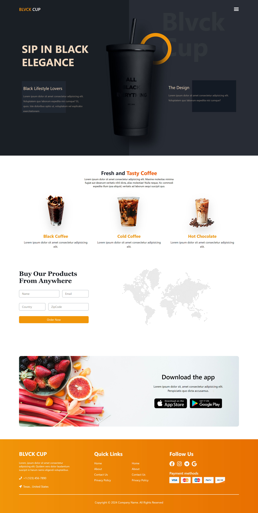
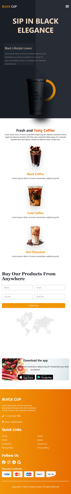

# Blvck Cup 

A sleek and modern coffee website that blends elegant UI with smooth animations using Framer Motion and React. The site showcases a bold identity with seamless transitions, dynamic theming, and a high-contrast layout that captures attention.

## 🛠 Features

- Animated circle build using `framer-motion`
- Responsive design
- Clean dark/light split layout
- Smooth UI transitions

## 🧰 Tech Stack

- ⚛️ React.js
- 🎨 Tailwind CSS
- 🎞️ Framer Motion
- 🌐 Hosted on Netlify

## 📸 Preview

Here are a few screenshots of the website:

- 

- 

## 🚀 Getting Started

### Prerequisites

Make sure you have the following installed:

- Node.js (>= 14)
- npm or yarn

### Installation

# Clone the repo
git clone https://github.com/AsadKhan-11/Blvck-Cup.git

# Navigate into the project
cd "blvck cup"

# Install dependencies
npm install

# Start the development server
npm run dev
